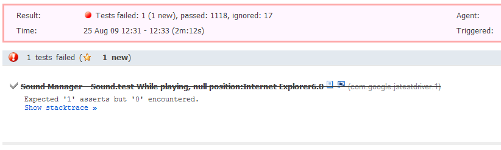

[JS Test Driver](http://code.google.com/p/js-test-driver/) is a great new Javascript Testing Framework from the guys at Google. It provides a blisteringly fast, and easily automated way of running your Javascript unit tests. See this [introduction to JS Test Driver by Miško Hevery](http://misko.hevery.com/2009/05/22/yet-another-javascript-testing-framework/) for a great overview.

Getting JS Test Driver up and running on your development workstation is easy enough. But how about on a continuous integration server such as [TeamCity](http://www.jetbrains.com/teamcity/)?

It's easy, just follow the instructions below!

## Install Java and the JS Test Driver jar on all the build agents

JS Test Driver is packaged as a Java jar, and therefore all the TeamCity build agents will need a copy of Java and the JS Test Driver jar in order to run the tests.

*   For each Build Agent
*   [Download Java](http://www.java.com/en/download/manual.jsp) and install it.
*   [Download the JS Test Driver jar](http://code.google.com/p/js-test-driver/downloads/list) and save it to `c:\TeamCityBuildTools\JSTestDriver\` (or whichever location you wish)

## Configure JS Test Driver

This guide assumes you already have JS Test Driver and some tests set up on your local machine. If not see this [introduction to JS Test Driver by Miško Hevery](http://misko.hevery.com/2009/05/22/yet-another-javascript-testing-framework/).

Just make sure that the JS Test Driver config file is set to connect to the local machine, on port 9876 (on another port of your choice).
E.g.

```yaml
server: http://localhost:9876

load:
  # list of files to load here...
```

## Configure your build process to call JS Test Driver

Now that we have JS Test Driver installed on our build machines, and configured correctly, let's call it from our build process. At 7digital we are using MSBuild, so we can create a JSTestDriver Target as so:

```xml
<Target Name="JSTestDriver">
  <Message Text="##teamcity[progressMessage 'Running JS Test Driver']" Importance="high" />
  <Message Text="-------- Running JS Test Driver --------" Importance="high" />

  <PropertyGroup>
    <JSTestDriverJar>"$(BuildToolsPath)\JSTestDriver\jsTestDriver.jar"</JSTestDriverJar>
    <ConfigFile>"$(SolutionFolder)\jsTestDriver.conf"</ConfigFile>
    <IEPath>"C:\Program Files\Internet Explorer\iexplore.exe"</IEPath>
    <OutputDir>"$(SolutionFolder)\output\JSTestDriver"</OutputDir>
  </PropertyGroup>

  <Exec Command="java -jar $(JSTestDriverJar) --port 9876 --browser $(IEPath) --config $(ConfigFile) --tests all --testOutput $(OutputDir)" />

</Target>
```

The important points here are that you have the properties configured correctly (JSTestDriverJar, ConfigFile, etc) for your individual setup.

The Exec command will automatically create a JS Test Driver server, launch IE, and run all the tests. The test results will be output to the OutputDir in a JUnit compatible xml format. See the [JS Test Driver continuous integration page](http://code.google.com/p/js-test-driver/wiki/ContinuousBuild) for more information.

Once you have created this Target, ensure it is called by your standard bulid Target by adding it as a dependancy:

```xml
<Target Name="BuildAndUnitTest" DependsOnTargets="Compile;JSLint;JSTestDriver;NUnit" />
```

## Have TeamCity pick up the test results

If you run your build through TeamCity now, you will see that it runs all your Javascript tests using JS Test Driver. But it doesn't report any results. And test failures don't stop the build.

Luckily TeamCity can import the JS Test Driver output xml, because it is JUnit compatible.

*   Select the build which is running the JS Test Driver tests
*   Click `Edit Configuration Settings`
*   Click on build step 3 (e.g. `Runner: MSBuild`)
*   Under the `XML Report Processing` section, choose `Ant JUnit` from the `Import data` from dropdown
*   In the `Report paths` text area add the relative path the the JS Test Driver output file (e.g. `output\JSTestDriver\TEST-com.google.jstestdriver.1.xml`)
*   Click `save`!

Now when you run your build again you will see your JS Test Driver tests showing up in the Tests tab, and test failures now stop the build.

Your Javascript unit tests now sit as first class citizens within TeamCity!

[](JSTestDriverFailedTest.png)
