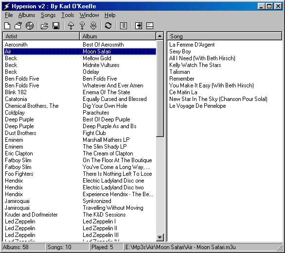
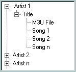

A small utility I wrote which provides easy access to all your music.

Hyperion lists music by artist and album, just click on an album to play it in Winamp.
It sits unobtrusively in your system tray, and does not require your music to be ID3 tagged.

## Screen Shot

## Download Latest Version

**[Hyperion 2.35](hyp-2.35.exe)**

### All Versions

*   [Hyperion 2.35](hyp-2.35.exe)
*   [Hyperion 2.34](hyp-2.34.exe)
*   [Hyperion 2.33](hyp-2.33.exe)
*   [Hyperion 2.32](hyp-2.32.exe)
*   [Hyperion 2.31](hyp-2.31.exe)
*   [Hyperion 2.30](hyp-2.30.exe)
*   [Hyperion 2.10](hyp-2.10.exe)
*   [Hyperion 2.00](hyp-2.00.exe)
*   [Hyperion 0.82](hyp-0.82.exe)
*   [Hyperion 0.81](hyp-0.81.exe)
*   [Hyperion 0.75](hyp-0.75.exe)
*   [Hyperion 0.70](hyp-0.70.exe)

## About Hyperion

### What is Hyperion?

Hyperion at its most basic level will list all your music albums and allow you to play them through Winamp. It is designed to search for your music and albums and give you easy access to playing the songs you want when you want. It also provide support for playing Audio CDs through Winamp. Hyperion will sit out of your way in the system tray and provide quick access to all its features from the system tray icon. Hyperion also supports other features such as saving and loading of Album lists in .m3u format and the storage of usage data so Hyperion learns what music you listen to and can then be used to play albums you like.

### System Requirements

*   Windows 95 (or higher)
*   Winamp 1.x (or higher), or any Mp3 player with support for the same command line options

### Using Hyperion for the first time

When you load Hyperion for the first time it will present you with the options dialog. Take some time to look through all the options and configure Hyperion the way you want.

The first thing you will want to do is set up some search directories so Hyperion knows where to find your music. To do this click on the _Search Dirs_ tab at the top of the options dialog. This will bring up the Search Directories page, make sure the _Use Search Directories_ checkbox is ticked. Click on the _Add_ button to add directories to the list until you have given Hyperion all the directories you want it to search.

Once you have set up all the options you will want to click on the _OK_ button and exit the options screen. Hyperion will now search for music in the directories you specified.

If you have correctly set up your search directories Hyperion will now make a list of all your albums. To see the songs contained in an album all you need to do is click on the album and the songs appear in the second pane. To play an album just double click on the one you want. It is possible to add more albums to Winamp without removing the old ones by right clicking on the album you want to add and selecting the _Enqueue Albums_ option. You can also Enqueue albums by holding down the Alt key and double clicking.

You now know enough to make good use out of Hyperion.

### Tips on using Hyperion

*   Hold down Alt and double click to Enqueue an album or song.
*   Click on the column header in the lists to order the albums by artist or album name, similarly click on the song column header to sort the songs alphabetically.
*   After selecting multiple albums press F6 to show the songs contained in all of them.
*   Using the slide or fade effects on the main form may cause graphical problems where the scrollbars don't appear and the status bar does not show any information. If this happens don't use the effects.
*   To contact me or visit the Hyperion website, use the hyperlinks in the About box.
*   Hyperion can take some simple command line arguments:

    <dl>

    <dt>-r </dt>

    <dd>if Hyperion is already running this will play a random album from those available</dd>

    <dt>-p </dt>

    <dd>if Hyperion is already running this will play a popular album from those available</dd>

    <dt>-u </dt>

    <dd>if Hyperion is already running this will play an unpopular album from those available</dd>

    <dt>-s </dt>

    <dd>show the main form</dd>

    <dt>FileName.m3u </dt>

    <dd>Add album(s) from the given m3u</dd>

    <dt>C:\Dir\ </dt>

    <dd>Recursively add albums from the given directory</dd>

    </dl>

### Hyperion v2.34

*   Removed the bug where pressing any key with the albums list selected would remove all the songs if more then one album was selected.
*   Hyperion will now detect albums using a case insensitive compare, so it now picks up '.M3U' files correctly.
*   Added a find song feature to Hyperion, this is still being worked on and is very slow at building the song list at present.

### Hyperion v2.33

*   Fixed the bug where ampersands (&) would be displayed as underscores in the splash screen and some hints.
*   You can now double click on the albums in the usage data list to play them.
*   Album and Artist names are shown properly in the usage data list now.
*   If you leave your cursor over the status bar a hint will appear allowing you to read all the text on it.
*   Now removes the artist name from songs correctly for artists beginning with 'The '.

### Hyperion v2.32

*   Added a new option to have Hyperion minimise every time you play an album or song.
*   Fixed the bug where hyperion would keep appending \ to the end of directory names every time you reopened it. It was stopping people playing albums without an .m3u.

### Hyperion v2.31 - First Release to Winamp

*   Added new command line options, -p, -u to play popular and unpopular albums respectively.

### Hyperion v2.30

*   Supports searching of multiple directories for Mp3s.
*   You can save lists of albums as Mp3s and automatically load them again when Hyperion loads.
*   Keeps track of which albums you listen to most and has the option to play a popular or unpopular album, based on what you listen to.
*   Supports playing CDs in Winamp, with the ability to select from multiple drives.
*   Very fast searching of Mp3s.
*   Limited support for searching and playing over Local Area Networks.
*   Fixed the problem of missing album name when loading an album list that contained directories without an m3u.
*   Hyperion now saves your options and usage data every 5 mins so you will no longer lose it if windows crashes or you don't close Hyperion.

### Previous Version of Hyperion

*   Similar features to those mentioned above but with more bugs.

## Other Information

Hyperion works best if you store each album in a separate directory with its .m3u file (if it has one, they are not compulsory). Hyperion detects the album and artist names from the directory structure of the albums. It takes the directory the .m3u is in as the albums name, and the parent directory as the artist name. Below is a diagram of the preferred structuring:

