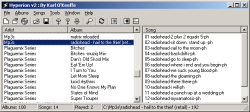
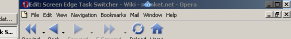
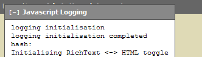

Personal Homepage of Karl O'Keeffe.

## [Blog](blog/)

My programming blog.

## [Sign Monkey](http://signmonkey.net/)

An incomplete, badly signed, low quality video dictionary of British Sign Language :)

## [Dancing Monkeys](dancing-monkeys/)

Automatically generate DDR steps to any music. My individual project while studying computing at Imperial College London.

## [Loris - Autotest and build for JavaScript](https://github.com/karl/loris)

Loris is a simple tool to automatically test and build your JavaScript and CoffeeScript on every file change.

[Download it as a Ruby gem](http://rubygems.org/gems/loris).

The [Loris source can be found on GitHub](https://github.com/karl/loris "https://github.com/karl/loris").

## [Monket Google Calendar](https://github.com/karl/monket-google-calendar)

A new version of Monket Calendar backed by Google Calendar. It provides an infinite scrolling view of all your events, and the ability to add, edit, and delete events.

Check out the [Monket Google Calendar source is on GitHub](https://github.com/karl/monket-google-calendar).

## [Monket Calendar](/monket-calendar) (old)

The old version of my AJAX enabled online calendar. Works in Firefox, Opera, Safari, and Internet Explorer (IE support is still buggy).

## [Hyperion](hyperion/)

A utility to provide easy access to all your music.

## [Screen Edge Task Switcher](screen-edge-task-switcher/)

More efficient task switching using the mouse.

## [Javascript Logging](javascript-logging/)

A simple javascript logging framework.

## [Web to File System](web-to-file-system/) Firefox Extension

A Firefox extension which allows you to open the File System view of a website.

## [PHP Wiki Status Code Plugin](php-wiki-status-code-plugin/)

A plugin to give a wiki page an alternate http return code (for [PhpWiki](http://phpwiki.sourceforge.net/phpwiki/index.php?HomePage)).

* * *

## Other

### [Curriculum Vitae](https://www.karlokeeffe.com)
