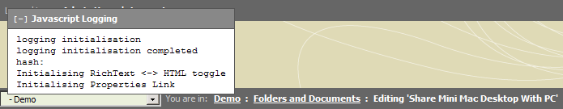

A simple javascript logging framework.

Javascript Logging provides an unobtrusive way of debugging your javascript. A small expandable div positioned in the top left corner of your page displays the logs. Any errors logged using logError(e) automatically expand the log, providing instant feedback when something goes wrong. Logging can be turned off for production systems without having to remove all the logging code.

## Screenshot



## Download Latest Version

[Javascript Logging v1.2](javascript-logging-1.2.zip)

### All Versions

*   [Javascript Logging v1.2](javascript-logging-1.2.zip)
*   [Javascript Logging v1.1.01](javascript-logging-1.1.01.zipzip")
*   [Javascript Logging v1.1](javascript-logging-1.1.zip)
*   [Javascript Logging v1.0](javscript-logging-1.0.zip) (does not work, missing class.js)

## Usage

### In Your HTML

```html
<script language="JavaScript" type="text/javascript" src="js/logging.js"></script>
```

### In Your Javascript

```javascript
try {
  // ...
  log('value of foo: ' + foo);
  //...
} catch(e) {
  logError(e);
}
```

## Options

```javascript
loggingDisplay = false;                   // The log will no longer be created or displayed

loggingStartExpanded = true;              // The log will start expanded

LOGGING_BASE = '/javascript-logging/';    // The location where javascript logging was unzipped to
```
