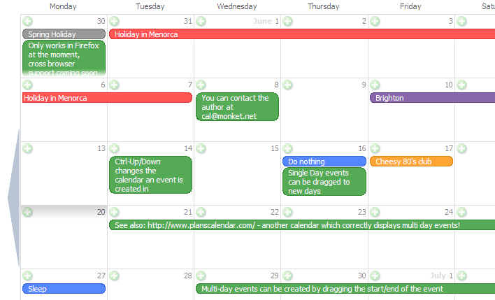

## This is an old version

The new version of my Monket Calendar can be found at:

[Monket Google Calendar](https://github.com/karl/monket-google-calendar)

The new version uses the Google Calendar API so you need allow it access before you can try it out. The source code is available on the [Monket Calendar GitHub page](http://github.com/karl/monket-google-calendar).

## About

An Ajax enabled online calendar. Drag and drop events to change dates, drag the start/end of an event to create multi-day events, create and edit events without refreshing the page, all with an iCal style interface.

This release now works in all major browsers (Firefox, Opera, Safari, and Internet Explorer). IE support still has a few bugs, namely the previous/next month links not working, and the need to click on a multi-day event before you can resize it.

## News

#### Monket Calendar at Editsite.net

The folks at Editsite.net have taken the Monket Calendar beta as a base, tarted it up a bit, and are offering it to their customers. Check it out: [Editsite.net Calendar](http://www.editsite.net/news/new_calendar.html).

#### Beta 0.9.1 (Fixes updating)

Fixed an incorrect path to the update script, so changes made to the calendar will now be saved.

#### Beta 0.9 and the source code are now available

Code is available in the Downloads section.

#### Beta 0.1.2 is now available

This release now works in all major browsers (Firefox, Opera, Safari, and Internet Explorer). IE support still has a few bugs, namely the previous/next month links not working, and the need to click on a multi-day event before you can resize it.

## Screenshot

## Info

Monket Calendar is coded in HTML, CSS, Javascript, and PHP. It is based on the premise of providing an Apple iCal style interface that is available wherever you are. The interface has been designed to make it as easy as possible to add/change/remove events and thereby reduce the frustration of using the browser for entering and managing data.

The layout of the events is also important, Monket Calendar is one of the only web based calendars can displays multi-day events spanning accross the days on which they occur ([Plans Calendar](http://www.planscalendar.com/) is the only other one I've seen). This spanning of events makes it much easier to read the calendar at a glance.

I made extensive use of exisitng libraries to speed up my development work, including:

*   [PHPiCalendar](http://sourceforge.net/projects/phpicalendar/) for parsing .ics files
*   [DataRequestor](http://mikewest.org/projects.php?action=viewProject&projectID=1) for Ajax calls
*   [ie7](http://dean.edwards.name/IE7/) for Internet Explorer compatibility
*   [DOM-Drag](http://www.youngpup.net/2001/domdrag) for javascript drag and drop support
*   [DOM Tooltop](http://www.mojavelinux.com/cooker/demos/domTT/) for javascript tooltip support

## Downloads

#### Latest Release

**[Beta 0.9.1](monket-cal-0.9.1.zip)**

#### All Releases

*   [Beta 0.9.1](monket-cal-0.9.1.zip)
*   [Beta 0.9](monket-cal-0.9.zip)

## Usage

### Requirements

*   PHP 4+
*   Apache with RewriteRules enabled

### Installation

*   Copy both the monket-cal-source/ and monket-cal/ directories to your web server.
*   Edit monket-cal/monket-cal-config.php
    *   Change SITE_DIR to the absolute URL of the location of monket-cal/ e.g. '/~myuser/monket-cal/'
    *   Change CALENDAR_DIR to the filesystem location of your .ics calendars e.g. '/home/myuser/hosting/web/monket-cal/calendars/'
    *   Change MONKET_BASE to the absolute URL of monket-cal-source/ e.g. '/~myuser/monket-cal-source/'
    *   Change MONKET_SOURCE to the filesystem location of monket-cal-source/ e.g. '/home/myuser/hosting/web/monket-cal-source/'
    *   Change DEFAULT_CALENDAR to the name of the calendar your wish to create events in by default e.g. 'Home'
    *   Add any calendars you want imported to the $MonketWebCals array. e.g. $MonketWebCals[] = 'http://ical.mac.com/ical/UK32Holidays.ics';
*   Load up the monket-cal/ URL in your browser and enjoy! e.g. 'http://www.mydomain.net/~myuser/monket-cal/'

## Change Log

*   Fixed incorrect reference to monket-cal-update.php in monket-cal/update/index.php (Thanks to Randall Blecher and Paul Adams for the heads up).

## Bugs/Missing Features

Monket Calendar is still in Beta, which means there are known bugs and missing features.

*   Internet Explorer support is still poor. The prev/next month buttons do not work, and you must edit a multi-day event before you can resize it.
*   You cannot change the colour/calendar of an event after it has been created.
*   Resizing multi-day events causes a page refresh (should really be done with Ajax).
*   The fade out at the bottom of each day is incorrectly positioned in Safari.
*   In Opera creating/editing an event does not automatically focus the text field.
*   Rounded corners only show up in Firefox.

## The Author

Monket Calendar was written by [Karl O'Keeffe](/) (but couldn't have be written without the help of the authors of the libraries mentioned in the info section).

As of 25th June 2005 I am taking a year out to travel the world, so I will be unable to maintain Monket Calendar. If you are interested in taking over the project from me, conttact me by email ([cal@monket.net](mailto:cal@monket.net)). I'll try and check my email at least once a week while trekking through Asia.

Upon my return I'll be looking for work in the Information Architecture/Interface Design side of IT. If you have anything that might interest me please let me know ([cal@monket.net](mailto:cal@monket.net)). [CV](https://www.karlokeeffe.com) is available online.

## License

Monket Calendar is released in two flavours.

#### GPL

One under the [GPL](http://www.gnu.org/copyleft/gpl.html) as a fully working PHP application using the PHPiCalendar project to parse the .ics files.

#### Creative Commons

The second flavour is released under the [Creative Commons 2.5 License](http://creativecommons.org/licenses/by/2.5/) and does not include the GPL licensed PHPiCalendar. This flavour requires an alternate .ics parser (not included I'm afraid).

Monket Calendar can be used in commercial applications, but unless you ship your source code with the application you can only the Creative Commons licensed part. This is because PHPiCalendar is licensed under the GPL, which requires that you ship your source code with your project.

If your project is never released to the public (internal company project for example) than you are free to use the GPL code without having to make your changes public.

[Creative Commons 2.5 License](http://creativecommons.org/licenses/by/2.5/)
