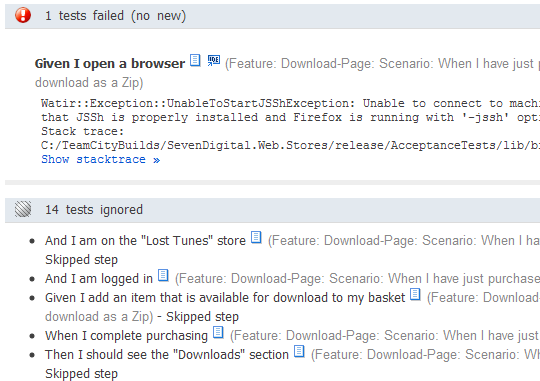

[TeamCity](http://www.jetbrains.com/teamcity/) is a great continuous integration server, and has brilliant built in support for running [NUnit](http://www.nunit.org/) tests. The web interface updates automatically as each test is run, and gives immediate feedback on which tests have failed without waiting for the entire suite to finish. It also keeps track of tests over multiple builds, showing you exactly when each test first failed, how often they fail etc.

If like me you are using [Cucumber](http://cukes.info/) to run your acceptance tests, wouldn't it be great to get the same level of TeamCity integration for every Cucumber test. Well now you can, using the `TeamCity::Cucumber::Formatter` from the TeamCity 5.0 EAP release.

JetBrains, the makers of TeamCity, released a [blog post demostrating the Cucumber test integration](http://blogs.jetbrains.com/ruby/2009/08/testing-rubymine-with-cucumber/), but without any details in how to set it up yourself. So I'll take you through it here.

## Getting a Copy of the TeamCity Cucumber Formatter

The [latest TeamCity EAP](http://www.jetbrains.net/confluence/display/TW/TeamCity+EAP) contains the new Cucumber Formatter hidden deep in it's bowels. Rather than make you wade through it all, I've extracted the relevant files and they are available to download here:

#### [Download the TeamCity Cucumber Formatter](TeamCityCucumberFormatter.zip)

The archive contains the formatter and the TeamCity library files it requires to run. Extract the archive in your project root and it will add the following files:

```plain
features/
    support/
        jetbrains-teamcity-formatter.rb
lib/
    teamcity/
        [some support and utility files]
```

If you want to locate these files within the TeamCity EAP yourself, [download the TeamCity 5.0 EAP War](http://download.jetbrains.com/teamcity/TeamCity-10307.war) file and extract it. Then from within the war unzip `WEB-INF/plugins/rake-runner-plugin.zip`. And from within the rake-runner-plugin look at `rake-runner/lib/rb/patch/bdd/teamcity/cucumber/formatter.rb` and all the files in `rake-runner/lib/rb/patch/common/teamcity/`.

The formatter in my download has been tweaked to look in a new location for the teamcity support files, and has been changed to be a single class in a module named `JBTeamCityFormatter` (to ease calling it from the command line).

The relevant changes in the file are:

```ruby

$: << File.expand_path(File.dirname(__FILE__) + '/../../lib/')
require 'teamcity/runner_common'
require 'teamcity/utils/service_message_factory'
require 'teamcity/utils/runner_utils'
require 'teamcity/utils/url_formatter'

class JBTeamCityFormatter < ::Cucumber::Ast::Visitor
```

## Setting up Cucumber to use the TeamCity Formatter

Once you have the formatter installed you can use it as with any Cucumber formatter by adding it as a command line parameter:

```bash
cucumber features -f JBTeamCityFormatter
```

To use it with TeamCity, add a profile your `cucumber.yml` file that runs all your features using the new formatter:

#### cucumber.yml
```yaml
default: features -q
teamcity: features -q --no-c  -f JBTeamCityFormatter
```

## Running Cucumber with TeamCity

Now when you run Cucumber within TeamCity (using the `teamcity` profile) it will report tests in real time, with all the feedback you are used to. Just add a call to the Cucumber executable to your build script (NAnt, MSBuild, Ant, Rake, etc).



Enjoy the new found treatment of Cucumber tests as first class citizens in TeamCity!
