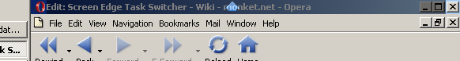

Provides a more efficient way of switching tasks in Windows using the mouse.

To switch between two tasks quickly using the keyboard, a user can simply press Alt-Tab to toggle between the two windows.

Using the mouse the user must click on the taskbar button of the window to toggle to. The user must remember which window is currently active and locate the taskbar button of the window to toggle to. This is very slow compared to using Alt-Tab on the keyboard.

This application fixes this by making one side of the screen act like Alt-Tab when it is clicked.

## Screenshot

## Download Lastest Version

**[Screen Edge Task Switcher 0.6](Screen%20Edge%20Task%20Switcher%200.6.exe)**

**Note**: This software is incomplete, and will be missing features and contain bugs.

**Note**: Requires the .net runtime to be installed. [Download the .net runtime](http://download.microsoft.com/download/a/a/c/aac39226-8825-44ce-90e3-bf8203e74006/dotnetfx.exe).

## All Versions

*   [Screen Edge Task Switcher 0.6](Screen%20Edge%20Task%20Switcher%200.6.exe)
*   [Screen Edge Task Switcher 0.5](Screen%20Edge%20Task%20Switcher%200.5.exe)
*   [Screen Edge Task Switcher 0.4](Screen%20Edge%20Task%20Switcher%200.4.exe)
*   [Screen Edge Task Switcher 0.3](Screen%20Edge%20Task%20Switcher%200.3.exe)
*   [Screen Edge Task Switcher 0.2](Screen%20Edge%20Task%20Switcher%200.2.exe)
*   [Screen Edge Task Switcher 0.1](Screen%20Edge%20Task%20Switcher%200.1.exe)

## Known Bugs

*   Will sometimes refuse to allow all windows to be minimised.
*   Arrow icon does not show up if the task switcher is aligned to the bottom or right hand side of the screen (error is in VS.net).
*   Crashes if there are no windows open.
*   Does not seem to work with .net runtime 1.1
