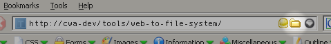

**A Firefox extension which allows you to open the File System view of a website.**

E.g. for a given page on your development web server this will open the corresponding folder in a windows share for the server. The mappings between web pages and the file system is configurable.

File can also be open directly by middle clicking on the folder icon. If the file extension is registered with you text editor then you can use this feature to directly open files for editing.

## Install

[Web to File System (1.0.1)](web-to-file-system.xpi)

### Previous Versions

*   [Web to File System (1.0.1)](web-to-file-system.1.0.1.xpi)
*   [Web to File System (1.0)](web-to-file-system.1.0.xpi)

## Configuration

You need to add the Web to File System mappings using `Tools | Extensions`, selecting 'Web to File System' in the extension list, and clicking `Options`

### Example Mappings

```
example.com/           X:\hosting\example\htdocs\
example.com/photos/    Y:\media\example\
```

These mappings are dependent on which drive letters you have mapped the network shares to.

## Usage

To open the File System view of a web page click on the folder icon on the right of the location bar.

To open the page directly for editing, `Ctrl`+click or middle click on the folder icon.



## Miscellaneous

When you invoke Web to File System with a middle click for a URL that maps to a directory, Web to File System checks that directory for an index file, and if it finds one it will use open that file.

The following index files are checked for (in order from top to bottom):

*   index.php
*   index.php5
*   index.php4
*   index.php3
*   index.asp
*   index.aspx
*   default.asp
*   default.aspx
*   index.shtml
*   index.html
*   index.htm
*   index_e.php
*   index_m.php

## Change Log

### Version 1.0.1

Added CWA attribution notice to About dialog.

## Attribution

Web to File System was developed while working at [CWA New Media](http://www.cwa.co.nz)

## License

Web to File System is released under the [GNU GENERAL PUBLIC LICENSE Version 2](http://www.gnu.org/copyleft/gpl.html)
